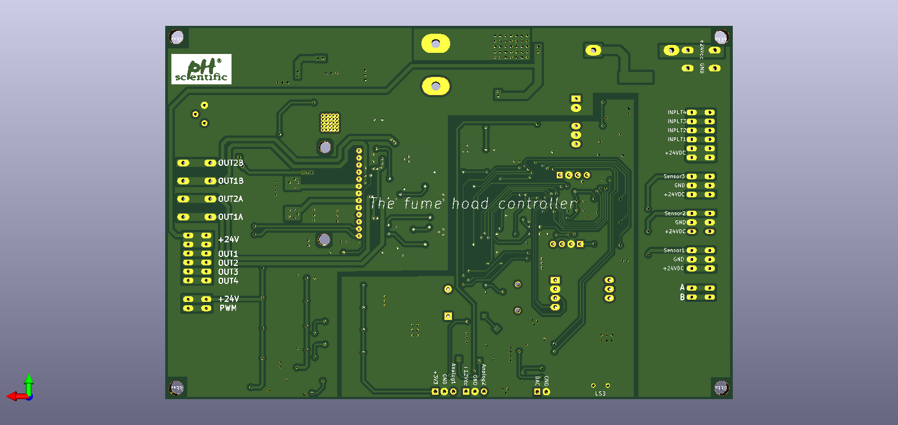

# ph_door_fume_hood_controller_hw
This is hardware sample and reactor controller for project the door fume hood.

# Description

## Features:
    * Power input 24VDC (isolation 24VDC - 5VDC 1W)
    * 3 sensor input are activated at level low.
    * 4 output are activated at level low.
    * 4 input are activated at level high.
    * Control step mottor with current upto 4A.
    * Communication 485 (status, control signal,...), I2C, analog signal.
# Hardware
## Schematics

[Download](./ph_door_fume_hood_controller_hw.pdf)

## PCB Layout

## 3D Review

## Pinout

# Gerber

[Download](./gerber/gerber_ph_door_fume_hood_controller_hw.zip)

# BOMLIST

[Download](./assets/ph_door_fume_hood_controller_hw.csv)

# License

